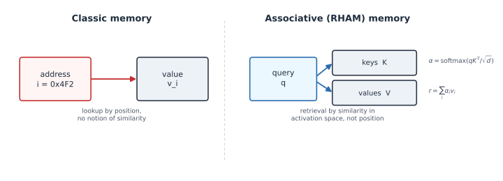
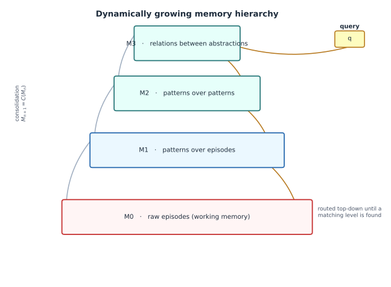
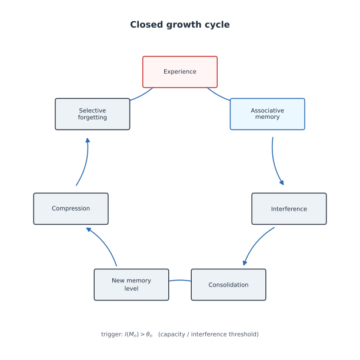

# A growing hierarchy of associative memory: notes on an architecture hypothesis

This is a concept note, not a paper. It describes an untested architecture
hypothesis called RHAM (Recursive Hierarchical Associative Memory), the
synthetic simulations run against it so far, and an honest accounting of
where it overlaps with existing published work. Nothing here is
peer-reviewed or validated on real data at scale. If you work on
associative memory, continual learning, or memory-augmented architectures,
I'd like your criticism.

## The hypothesis

Classical memory maps an address to a value. RHAM replaces the address with
a learned, content-based lookup — a Q/K/V-style associative read, as in
attention:

```
q → softmax(q·Kᵀ/√d) → weighted sum over V
```



That part alone is not new. The actual hypothesis concerns what happens
when a single associative memory runs out of room: instead of only getting
bigger, it grows a new level above itself that compresses what's below.
Write $M_0$ for a raw episodic buffer, and define

$$M_{n+1} = C(M_n)$$

where $C$ is a consolidation operator (in the simulations: clustering /
prototype formation). A new level is not built on a fixed schedule but
*triggered*: when a level $M_n$'s internal interference — roughly, how
often stored patterns are too close together to retrieve cleanly — crosses
a threshold, and a structure test confirms exploitable structure (rather
than unstructured noise), a new level $M_{n+1}$ is created above it.
Queries then route top-down: a query first meets the most abstract level
that can plausibly place it, narrowing the search before it reaches the raw
episodes.



Two more pieces close the loop. Offline consolidation periodically rebuilds
the upper levels from what has accumulated below ("sleep"). Selective
forgetting demotes an episode out of the fast associative layers once a
higher level can reconstruct it well enough — demotion to a cheaper archive,
never deletion, so content is harder to reach but not actually lost.

The five rules, stated plainly:

1. **Distributed storage** — activation patterns, not addresses.
2. **Associative retrieval** — Q/K/V-style attention.
3. **Dynamic hierarchy** — a new level forms on interference + a structure
   test, not on a fixed schedule.
4. **Offline consolidation** — $M_{n+1} \leftarrow C(M_n)$.
5. **Selective forgetting** — demotion to an archive, keyed to
   reconstructibility from above.



One correction up front, since it's easy to overclaim here: physical storage
capacity does not grow exponentially this way. Shannon's limits still
apply — a system with $P$ parameters of $q$ bits stores at most $P \cdot q$
bits, full stop. What the hierarchy buys, if anything, is *combinatorial
addressability*: with $L$ levels of $K$ prototypes each, you can address up
to $K^L$ combinations while storing only $L \cdot K$ prototypes. Whether
that's worth anything depends entirely on how compressible the experience
stream is. On pure noise, the hierarchy is dead weight.

## What the simulations actually show

All of this was tested only on synthetic data — trees of correlated
"concepts" with controlled branching and noise, not real text or images
(beyond one small smoke test, see below). Four rounds, in order:

**Round 1** asked the most basic question: does the hierarchy retrieve more
than a flat modern Hopfield memory at the same parameter budget? Mostly no.
With unconstrained inverse temperature β and compute, a flat associative
memory matches or beats the hierarchy on raw accuracy. What the hierarchy
buys is (a) *sharp* retrieval — convergence onto a single pattern rather
than a metastable mixture — at a fixed, bounded β, the realistic regime for
trainable systems and constrained hardware, and (b) retrieval cost scaling
roughly logarithmically instead of linearly: at N = 4096 patterns, the
hierarchy needed about 50× fewer dot products for comparable sharp-retrieval
accuracy. Automatic level growth also worked as intended: exactly as many
levels as the data's tree depth needed, and zero extra levels on
unstructured i.i.d. noise across 20/20 runs.

**Round 2** moved to an online stream: 216 concepts arriving one episode at
a time at realistic (Zipf) frequency, half the concept space introduced
only partway through. This gave the information-theoretic claim its first
real test. Marginal storage cost per new episode converged to within about
0.3% of the data's true entropy rate (73.3 vs. 73.5 bits, against 151 bits
raw) — the quantitative form of "more experience, better representation,
not more bytes." After 20,000 episodes the system held about 270 vectors
associatively, versus 20,000 for a flat store, at 100% concept-retrieval
accuracy for old and new concepts alike, and roughly 31 dot products per
query instead of 20,000. Unsupervised concept discovery was close to exact:
213–216 learned prototypes for 216 true concepts.

**Round 3** stress-tested three failure modes. Overlapping concepts caused
real merging — at a sibling similarity of 0.85, 216 true concepts collapsed
to 104 distinguishable prototypes. A new splitting rule (test each
prototype's members against a one-concept null model; split if they don't
fit) recovered most of that, back up to 203 concepts and 99.3% accuracy;
at extreme overlap it still fell short of the flat baseline. Concept drift
(wandering cluster centers) was survivable for accuracy but revealed a real
cost: under strong drift, consolidation stalled and memory grew from 270 to
790 vectors as episodes could no longer be reconciled with their drifting
prototype. Rare single episodes split into two outcomes: atypical ones
(statistically distinct from anything else) were preserved perfectly;
typical-looking rare ones were associatively indistinguishable from the
crowd and lost from fast retrieval entirely (0% recall) — though still
exactly recoverable through the archive. Tagging important episodes fixed
this directly.

**Round 4** addressed the open problems from round 3. A complete "Rule 7"
— capped learning rate, an age limit forcing old episodes into the archive
regardless of reconstruction quality, retirement of inactive prototypes,
and merging of redundant ones — held accuracy at 100% for both common and
rare concepts under strong drift while halving memory use versus the
uncorrected baseline (600 vs. 1214 vectors). The sub-rules only worked as a
bundle: the capped learning rate alone was *worse* than nothing, because
stale buffered episodes won comparisons against prototypes that had since
drifted away. On anisotropic noise, the splitting test showed a real,
unresolved trade-off between sensitivity and specificity. A small follow-up
smoke test ran the same consolidation machinery on real text embeddings
(bge-m3, a few dozen documentation chunks) instead of synthetic vectors,
mainly to confirm the pipeline doesn't fall over on real data; the sample
was far too small to say anything about the underlying question.

## Honest prior art

A targeted (not exhaustive) literature check turned up substantial overlap:

- **Nested Learning / HOPE** (Behrouz et al., NeurIPS 2025) — nested memory
  levels at different update frequencies. Closest single match to
  memory-over-memory.
- **Titans** (NeurIPS 2025) — a neural long-term memory that keeps learning
  at inference time, over multi-million-token contexts.
- **Memory Layers at Scale** (Meta) — trainable key-value memory layers
  scaled to 128B parameters.
- **HMT (Hierarchical Memory Transformer)**, NAACL 2025 — hierarchical
  memory with recall and segment-wise recurrence, built as a critique of
  "flat" memory architectures.
- **"Language Models Need Sleep"** (Behrouz, Hashemi, Mirrokni, 2026) — an
  explicit sleep/consolidation/dreaming mechanism for stabilizing long-term
  knowledge.
- **DeltaStack** (ICML 2026) — a differentiable stack addressing the
  limits of fixed-size associative memory for recursive structures.

What this search did **not** find: an architecture where the *number or
depth* of memory levels grows dynamically as a function of accumulated
information — rather than being fixed in advance, as in HOPE — combined
with capacity-/interference-triggered creation of each new level, offline
consolidation, and selective forgetting, all in one closed loop. HOPE has
several levels at different update frequencies, but the level count is a
design choice, not an emergent property of how much the system has stored.
That combination — self-growing abstraction depth plus the full
consolidate-and-forget cycle — is the part I haven't found elsewhere. This
is a gap in a non-exhaustive search, not a priority claim.

## Open questions

This is not a result, it's a starting point. Turning it into something
closer to a real claim would need, at minimum:

- **An adversarial novelty search**, done properly, against Neural Turing
  Machines / Differentiable Neural Computers, adaptive-computation
  architectures, growing neural networks (cascade-correlation, growing
  neural gas, progressive/dynamically-expandable networks), hierarchical
  predictive coding, hippocampal–cortical memory models, and
  vector-symbolic / hyperdimensional computing. I've read around these
  areas, not searched them exhaustively.
- **Independent reproduction** of the simulation results above. They come
  from one person's code on synthetic data generated by that same code's
  assumptions — a real conflict of interest for anything claiming to
  "confirm" a prediction.
- **Real, non-synthetic empirical validation.** Everything quantitative
  above is on data generated to already look like a tree of concepts; the
  one real-embedding test was a pipeline smoke test on 57 text chunks,
  informative about whether the code runs, not about the hypothesis.
- Better resolution of the splitting-test trade-off under anisotropic
  noise, and a real aging/retirement policy for prototypes that doesn't
  rely on synthetic drift assumptions.

## If this is useful to you

I'm a practitioner with limited time, not someone who can run this research
program to completion alone. If you want to attack the novelty claim,
reproduce or break the simulations, or just tell me where the math is
wrong, I'd like to hear it — issues and pull requests on the repo are the
easiest way in.
